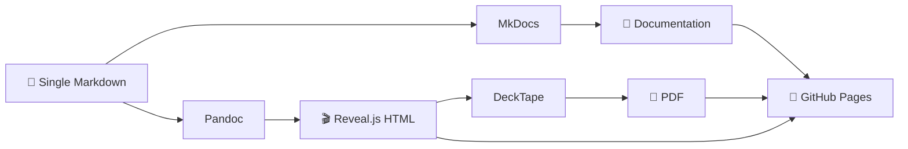

<div align="center">

# 📚 Hello MkDocs + Reveal.js

### Write Once, Publish Everywhere

[](https://github.com/ruslanmv/hello-reveal-mkdocs/actions)
[](https://opensource.org/licenses/Apache-2.0)
[](https://squidfunk.github.io/mkdocs-material/)
[](https://revealjs.com/)
[](https://www.python.org/)
[](https://pandoc.org/)

[Live Demo](https://ruslanmv.github.io/hello-reveal-mkdocs/) • [Documentation](https://ruslanmv.github.io/hello-reveal-mkdocs/) • [Report Bug](https://github.com/ruslanmv/hello-reveal-mkdocs/issues)

</div>

---

## 🎯 Overview

**The Problem:** Keeping documentation and presentations in sync is painful. Update your docs, forget the slides, and drift happens.

**The Solution:** Author **one** Markdown file and automatically publish it as:

- 📖 **MkDocs documentation page** (Material theme)
- 🎬 **Interactive Reveal.js HTML slides**
- 📄 **Professional PDF presentation**

All automated with Pandoc, DeckTape, and GitHub Actions.

<div align="center">



</div>

---

## ✨ Features

- ✅ **Single Source of Truth** — Write once, publish everywhere
- ✅ **Zero Drift** — Docs and slides always in sync
- ✅ **Beautiful Output** — Material theme + Reveal.js
- ✅ **PDF Export** — Professional decks via DeckTape (fixed timing for ALL slides)
- ✅ **Automated Deployment** — GitHub Actions → GitHub Pages
- ✅ **Version Control** — Full history in Git
- ✅ **Fast Setup** — `make install` and you're ready

---

## 🚀 Quick Start

```bash
# 1️⃣ Clone the repository
git clone https://github.com/ruslanmv/hello-reveal-mkdocs.git
cd hello-reveal-mkdocs

# 2️⃣ Install dependencies (Python + tools)
make install

# 3️⃣ Generate HTML slides
make slides

# 4️⃣ Export to PDF (requires Docker)
make pdf

# 5️⃣ Preview locally
make serve
# 🌐 Opens at http://127.0.0.1:8000
```

**That's it!** Your content is now available as:
- Documentation: `http://127.0.0.1:8000/`
- HTML Slides: `http://127.0.0.1:8000/slides/watsonx-agentic-ai.html`
- PDF Deck: `http://127.0.0.1:8000/slides/watsonx-agentic-ai.pdf`

---

## 📋 Prerequisites

| Tool | Version | Purpose | Installation |
|------|---------|---------|--------------|
| **Python** | 3.11+ | MkDocs runtime | [python.org](https://www.python.org/) |
| **Pandoc** | 2.9+ | Markdown → HTML | [pandoc.org](https://pandoc.org/installing.html) |
| **Docker** | 20+ | PDF export | [docker.com](https://www.docker.com/) |
| **uv** | Latest | Python package manager | Auto-installed by `make install` |

> 💡 **Tip:** Run `make check` to verify all tools are installed.

---

## 📁 Project Structure

```
hello-reveal-mkdocs/
├── 📄 docs/
│   ├── index.md                      # Homepage
│   ├── watsonx-agentic-ai.md        # 📝 Single source of truth
│   └── slides/                       # 🎬 Generated artifacts
│       ├── watsonx-agentic-ai.html  # (Auto-generated)
│       └── watsonx-agentic-ai.pdf   # (Auto-generated)
├── 🔧 scripts/
│   ├── generate_slides.sh           # Pandoc automation
│   ├── export_pdf.sh                # DeckTape with FIXED timing
│   └── bootstrap.sh                 # Tool installation helper
├── ⚙️  mkdocs.yml                    # MkDocs configuration
├── 📝 Makefile                       # Convenient commands
├── 🔄 .github/workflows/
│   └── deploy.yml                   # CI/CD pipeline
└── 📦 pyproject.toml                 # Python dependencies
```

---

## 🛠️ Available Commands

| Command | Description |
|---------|-------------|
| `make install` | Install all dependencies and tools |
| `make slides` | Generate Reveal.js HTML from Markdown |
| `make pdf` | Export slides to PDF (extended timing for ALL slides) |
| `make serve` | Run local development server |
| `make build` | Full build (slides + PDF + docs) |
| `make clean` | Remove all generated files |
| `make check` | Verify external tools are installed |

---

## 📝 Writing Content

Your Markdown file supports both documentation and presentation features:

```markdown
---
title: "Your Title"
author: "Your Name"
date: "2025-01-15"
---

# Introduction
This appears in both docs and slides.

## Main Topic {data-transition="slide"}
Each `##` heading becomes a new slide.

- Bullet points work everywhere
- Code blocks too

### Sub-topic {data-transition="fade"}
Use `###` for vertical sub-slides.

::: notes
Speaker notes (only visible in presenter mode)
:::
```

### Special Features

- **Transitions:** `{data-transition="slide|fade|convex|zoom"}`
- **Backgrounds:** `{data-background-color="#hexcolor"}`
- **Speaker Notes:** `::: notes ... :::`
- **Fragments:** `<span class="fragment">...</span>`
- **Math:** `$E=mc^2$` or `$$...$$` (with `--mathjax`)

---

## 🚀 Deployment

### Automatic Deployment (Recommended)

Push to `main` branch → GitHub Actions automatically:
1. ✅ Generates HTML slides
2. ✅ Exports PDF (with fixed timing for ALL slides)
3. ✅ Builds MkDocs site
4. ✅ Deploys to GitHub Pages

**Setup:**
1. Go to **Settings** → **Pages**
2. Select **Source:** GitHub Actions
3. Push your code

Your site will be live at:
```
https://YOUR_USERNAME.github.io/YOUR_REPO_NAME/
```

### Manual Deployment

```bash
make build
# Outputs to ./site/
# Upload to any static host
```

---

## 🔧 Configuration

### Change Theme

```bash
# For slides
REVEAL_THEME=night make slides

# Available: beige, black, blood, league, moon, night, serif, simple, sky, solarized, white
```

### Change Slide Size

```bash
# For PDF export
SLIDE_SIZE=1600x900 make pdf  # 16:9 widescreen
SLIDE_SIZE=1024x768 make pdf  # 4:3 classic
```

### Adjust PDF Timing

```bash
# If slides are complex and need more time
LOAD_PAUSE=12000 PAUSE=3000 make pdf
```

---

## 🐛 Troubleshooting

### "Printed 1 slides" instead of all slides

**✅ FIXED!** This was the main bug. The updated `export_pdf.sh` uses:
- `--load-pause 8000` (8 seconds, not 1.5)
- `--pause 2000` (2 seconds between slides)
- `--slides 1-100` (explicit range, not open-ended)

### PDF is blank or has wrong styling

```bash
# Increase timing
LOAD_PAUSE=10000 PAUSE=2500 make pdf
```

### "File css/reset.css not found"

**Auto-fixed!** The `generate_slides.sh` script auto-detects your Pandoc version and selects the compatible Reveal.js CDN.

### MkDocs can't find slides

```bash
# Ensure slides are generated before building
make slides
make pdf
make serve
```

---

## 🤝 Contributing

Contributions are welcome! Please feel free to submit a Pull Request.

1. Fork the repository
2. Create your feature branch (`git checkout -b feature/AmazingFeature`)
3. Commit your changes (`git commit -m 'Add some AmazingFeature'`)
4. Push to the branch (`git push origin feature/AmazingFeature`)
5. Open a Pull Request

---

## 📄 License

This project is licensed under the Apache License 2.0 - see the [LICENSE](LICENSE) file for details.

---

## 🙏 Acknowledgments

- [MkDocs](https://www.mkdocs.org/) - Static site generator
- [Material for MkDocs](https://squidfunk.github.io/mkdocs-material/) - Beautiful theme
- [Reveal.js](https://revealjs.com/) - HTML presentation framework
- [Pandoc](https://pandoc.org/) - Universal document converter
- [DeckTape](https://github.com/astefanutti/decktape) - PDF export tool

---

## 👤 Author

**Ruslan Magana Vsevolodovna**

- 📧 Email: [contact@ruslanmv.com](mailto:contact@ruslanmv.com)
- 🐙 GitHub: [@ruslanmv](https://github.com/ruslanmv)
- 🌐 Website: [ruslanmv.com](https://ruslanmv.com)

---

## ⭐ Star History

If this project helped you, please consider giving it a ⭐!

[](https://star-history.com/#ruslanmv/hello-reveal-mkdocs&Date)

---

<div align="center">

**[⬆ Back to Top](#-hello-mkdocs--revealjs)**

Made with ❤️ by [Ruslan Magana](https://github.com/ruslanmv)

</div>
